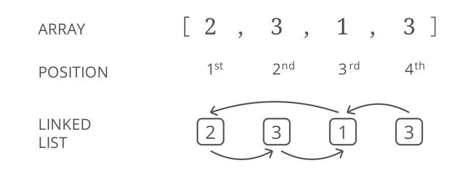

## Find a duplicate, Space Edition BEAST MODE

In Find a duplicate, Space Edition (find-duplicate-optimize-for-space), we were
given an array of integers where:

1. the integers are in the range 1.._n_
2. the array has a length of _n_ + 1

These properties mean the array _must have at least 1 duplicate_. Our challenge was to
find a duplicate number, while optimizing for _space_. We used a divide and conquer
approach, iteratively cutting the array in half to find a duplicate integer in O(_n_ lg _n_)
time and _O_(1) space (sort of a modifed binary search).

But we can actually do better. __We can find a duplicate integer in _O(n)_ time while
keeping our space cost at _O(1)___.

This is a tricky one to derive (unless you have a strong background in graph theory),
so we'll get you started:

__Imagine each item in the array as a node in a linked list__. In any linked list each node has a __value__ and a __"next"__ pointer. In _this_ case:

- The __value__ is the _integer_ from the array.
- The __"next"__ pointer points to the __value-eth__ node in the list (numbered starting
from 1). For example, if our value was 3, the "next" node would be the _third_
node.

Here’s a full example:

> __Notice we're using "positions" and not "indices."__ For this problem, we'll use the word "position" to mean
something like "index," but di erent: indices start at 0, while positions start at 1. More rigorously: position =
index + 1.

Using this, __find a duplicate integer in _O(n)_ time while keeping our space cost at
_O(1)_ .__
